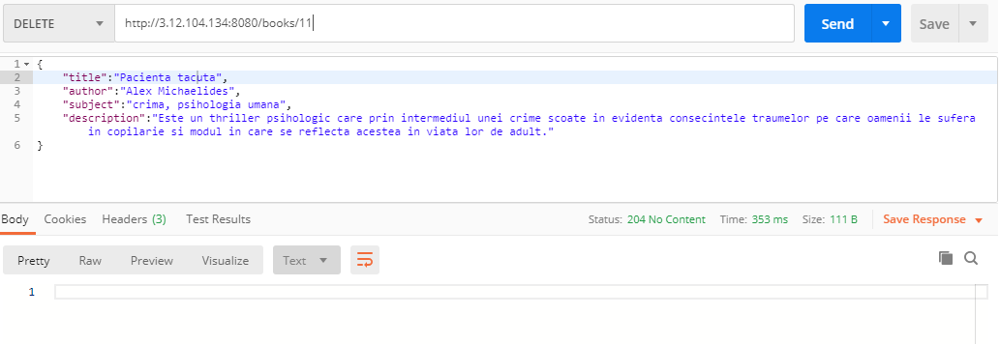
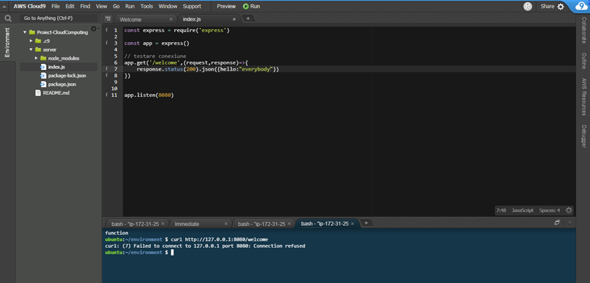
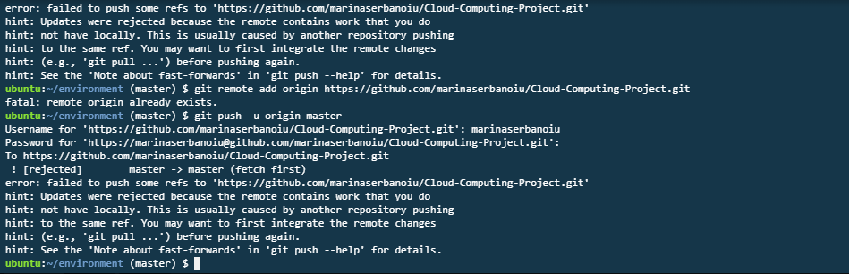

 # Proiect Cloud-Computing: Aplicație pentru gestionarea informațiilor despre cărțile citite/favorite
                                    
 ### Introducere

Aplicația dezvoltată de mine vine în ajutorul iubitorilor de cărți, oferindu-le acestora posibilitatea de a-și creea o listă de cărți favorite și de a putea cauta informații despre o anumită carte, prin intermediul unei bare de cautare.

 ### Descriere problemă
 O problemă cu care m-am confruntat și eu, ca și cititor a fost aceea că nu puteam să îmi amintesc uneori ce cărți am citit mai demult sau ce evenimente erau prezentate într-o anumită carte.
 Din acest motiv, m-am gândit să creez o aplicație care să gestioneze informațiile despre cărțile citite, dându-ți posibilitatea de a adăuga în listă titlul cărții respective, autorul, subiectul cărții sau o descriere scurtă în care să poți spune câteva cuvinte despre aceea carte. 
 Consider că este foarte util pentru un cititor să poată să își noteze undeva câteva detalii despre o carte citită și să aibă posibilitatea de a revedea oricând informații despre acele cărți. 
 ### Descriere API
 Aplicația are la bază 2 API-uri, unul creat de mine, prin care au fost evidențiate metodele HTTP și un API deja existent care a fost integrat în interiorul aplicației.
 Primul API, cel creat de mine, este folosit pentru a adăuga o carte în listă, a șterge și a salva informațiile adăugate.
 Acest API are în spate o bază de date MySql numită info_books, care are în alcătuirea sa tabela books.
 Cel de-al doilea API folosit în realizarea aplicației este Google Books API. Acest API este util deoarece iți dă posibilitatea să găsești informații despre anumite cărți: recenzii, un scurt rezumat etc. În aplicația mea, prin intermediul acestuia am reușit să creez bara de search, prin care utilizatorul poate căuta o anumită carte dupa titlul său exact sau după un cuvânt semnificativ.
 
 ### Flux de date
 Aplicația are la bază un server creat cu ajutorul Node.js și ExpressJs. Datele sunt stocate într-o bază de date MySql și pot fi accesate prin metodele HTTP (POST, GET, UPDATE, DELETE). Accesul la baza de date se realizează automat prin biblioteca Sequelize.
Utilizatorul va putea adăuga o carte, actualiza, șterge și afișa toate cărțile adăugate până atunci.
Atunci când utilizatorul face o cerere pe server de tip CRUD, serverul web va prelucra această cerere și va returna un conținut pe care browserul îl va interpreta și îl va afișa utilizatorului în format JSON,XML etc.
 ### 1) Exemple de request-response 
 ```
 { 
    "hello":"everyone"
 }
 ```
 
   
   
 ```
 {
     "title": "Silent Patient";
     "author":"Alex Michaelides"
 }
 ```
  <br/>
 ```
 {
     "Smartphone":"LenovoP70A";
     "Price":"800 Ron";
     "Guarantee":"1 year"
 }
 
 ```
   
 ### 2) Metode HTTP
  #### POST 
  Această metodă presupune crearea unor noi date pe server. În imaginea de mai jos, este reprezentat un request de tip POST, prin intermediul programului Postman.  
  
    
  #### PUT
  Metoda PUT actualizează datele de pe server. Aplicarea acestei metode pe datele de pe serverul aplicației mele se poate vedea în imaginea de mai jos.  
  
    
  #### GET
  Metoda GET are rolul de a afișa datele existente pe un server. În imaginile de mai jos, se poate vedea exemplificarea metodei GET pe datele de pe server.  
  
     <br/><br/> 
    
  #### DELETE
  Metode DELETE e folosită pentru a șterge date de pe server. Metoda se poate vedea exemplificată în imaginea de mai jos, prin intermediul Postman.  
  
    
   Se poate vedea în screenshot-ul de mai jos că resursa cu id=11, a fost ștearsă cu succes.  
   
     
 ### 3) Google Books API - Public API
 Serviciul utilizat de mine în cadrul aplicației, Google Books API nu a necesitat o autentificare cu APIkey sau Oauth înainte de utilizare. Fiind un API pe care doar se putea aplica metoda GET, am putut să afișez informații despre anumite cărți în funcție de căutare, fără nicio problemă. API-ul utilizat de mine a avut următoarea formă: https://www.googleapis.com/books/v1/{collectionName}/resourceID?parameters.  
 ### Capturi de ecran - aplicație
 Aplicația mea are următoarea interfață principală:  
 
   
 Din această interfață utilizatorul își poate adăuga o carte nouă, poate să vadă lista cărților adăugate sau poate să meargă în pagina de căutare dacă dorește informații despre o anumită carte.  
 
  <br/><br/> 
   <br/><br/>
 Dacă este interesat de o anumită carte utilizatorul poate apasă butonul READ MORE pentru a afla mai multe informații (recenzii, review-uri etc.)  
 
  <br/><br/>
 
 
 ### Erori întâmpinate în realizarea aplicației
  #### i) "Failed to connect to 127.0.0.1 port 8080: Connection refused"  
      
  #### ii) "Acest site nu poate fi accesat"
     
 #### Aceste erori erau datorate faptului că mediul de lucru nu era configurat să ruleze pe portul 8080. Era necesară setarea din imagine:
   
 #### Ultima eroare mai apare și în momentul când serverul nu a fost pornit.
 #### iii) Nu am putut să mai dau commit după ce am făcut primul commit  
  <br/><br/>
 Eroarea era datorată de la faptul că făcusem modificări pe GitHub asupra proiectului pe care nu le aveam și în mediul de lucru AWS Cloud 9. Era nevoie să actualizez mediul de lucru cu ceea ce era pe GitHub cu comanda "git pull" și apoi să dau commit la modificări.
   
  
  
 
 
 ### Referinte:
 https://developers.google.com/books/docs/v1/getting_started   
 https://www.w3schools.com/default.asp  
 https://docs.aws.amazon.com/elasticbeanstalk/latest/dg/eb-cli3-install.html  
 https://github.com/aws/aws-elastic-beanstalk-cli-setup
